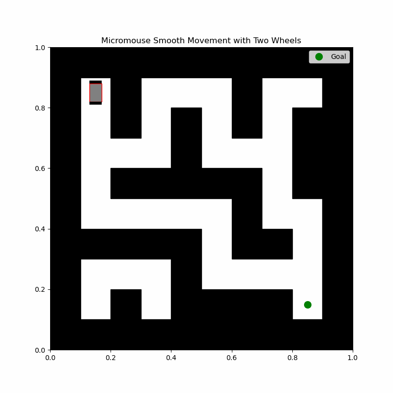

# Micromouse Maze Navigation
Python coursework simulations exploring grid navigation and state estimation.



## Run
From the repository root, with Python 3:
```bash
python -m pip install -r requirements.txt
python src/maze_navigation.py
python src/ekf_localization.py
```
Results are written to `output/`. For a quick animation use `--frames-per-segment 1`.

## Two separate demonstrations
- **Maze animation:** prioritizes right, forward, left and back while avoiding revisits; interpolates cell centres for display.
- **EKF localization:** estimates position, heading and velocities using simulated noisy encoders and a gyroscope in an obstacle-free environment.

## Scope and limitations
The maze is known in advance. The planner has no backtracking and may fail at dead ends on other mazes. Interpolation is a visual path, not a physical collision or motor simulation. Robot turns are instantaneous. The EKF is not integrated with the maze planner, and dead-reckoning position drift remains possible.

## Portfolio revision
Based on the supplied university scripts. The presentation version introduces named functions, command-line arguments, reproducible sensor noise and output paths. The EKF motion model was **changed** from the original voltage/dynamics experiment to a simplified first-order velocity response. Its measurement variances were corrected to squared standard deviations. The animation above is an original coursework output, not a newly measured hardware result.

## Validation
Python syntax checks and a reduced-frame GIF run passed. With seed 7, the revised EKF example reached the 5 cm stopping radius after 372 samples. This synthetic run is not evidence of hardware accuracy.

Qossay Assi · [LinkedIn](https://www.linkedin.com/in/qossay-assi/)
